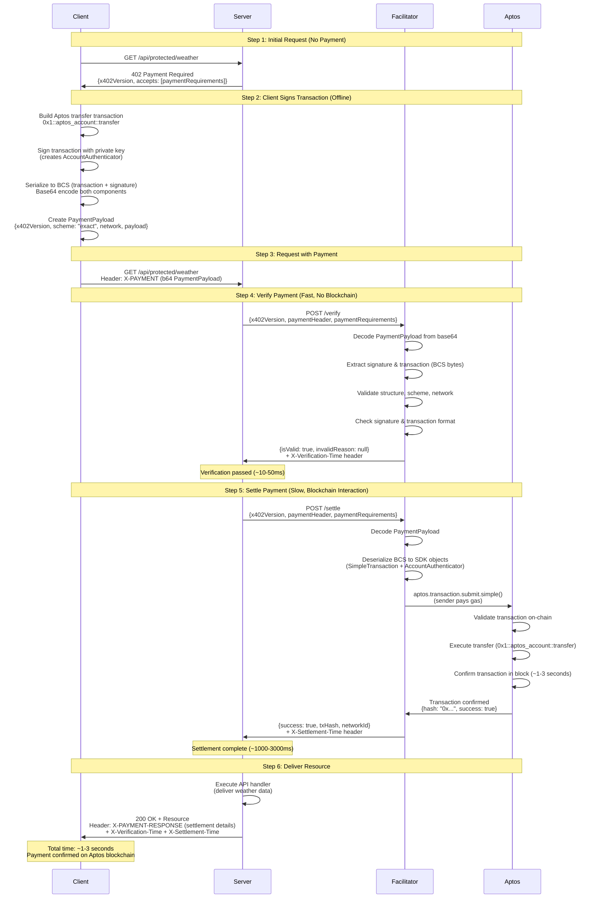

# x402 Protocol Sequence Diagram (Aptos)

## Flow Diagram



## Timing Breakdown

| Step | Duration | Description |
|------|----------|-------------|
| **1. Initial 402** | ~10-50ms | Server returns payment requirements |
| **2. Sign Transaction** | ~50-200ms | Client creates and signs Aptos transaction offline |
| **3. Verification** | ~10-50ms | Facilitator validates payment structure (no blockchain) |
| **4. Settlement** | ~1000-3000ms | Facilitator submits to Aptos & waits for confirmation |
| **5. API Processing** | ~10-100ms | Server executes business logic and delivers resource |
| **Total (with payment)** | ~1100-3400ms | End-to-end payment flow |

## Key Differences from EVM x402

| Aspect | EVM (Ethereum/Base) | Aptos |
|--------|---------------------|-------|
| **Encoding** | EIP-712 signatures | BCS (Binary Canonical Serialization) |
| **Transaction Function** | ERC-20 transfer / native send | `0x1::aptos_account::transfer` |
| **Settlement Time** | ~12-15 seconds | ~1-3 seconds |
| **Gas Payment** | Various patterns | Client pays (Pattern A) |
| **Signature Format** | ECDSA (secp256k1) | Ed25519 |
| **SDK** | ethers.js / viem | @aptos-labs/ts-sdk |

## Payment Payload Structure (Aptos)

```json
{
  "x402Version": 1,
  "scheme": "exact",
  "network": "aptos-testnet",
  "payload": {
    "signature": "base64-encoded-BCS-AccountAuthenticator",
    "transaction": "base64-encoded-BCS-RawTransaction"
  }
}
```

## Verification Process (Fast Path)

The verification step is designed to be **fast and cheap** (no blockchain interaction):

1. ✅ Decode base64 PaymentPayload
2. ✅ Validate x402Version, scheme, network
3. ✅ Check signature and transaction are valid base64
4. ✅ Verify both components have non-zero length
5. ⏩ Future: Deserialize BCS and verify signature cryptographically

**Result:** ~10-50ms validation before any blockchain interaction

## Settlement Process (Slow Path)

The settlement step interacts with the blockchain:

1. 📦 Decode and deserialize BCS components
2. 🔄 Reconstruct SDK objects (SimpleTransaction + AccountAuthenticator)
3. 📤 Submit using `aptos.transaction.submit.simple()`
4. ⏳ Wait for blockchain confirmation
5. ✅ Verify transaction succeeded on-chain

**Result:** ~1-3 seconds (Aptos testnet/mainnet)

## Error Handling

### Verification Fails
```
Server → Client: 402 Payment Required
{
  error: "Payment verification failed",
  message: "Invalid signature or transaction"
}
```

### Settlement Fails
```
Server → Client: 402 Payment Required
{
  error: "Payment settlement failed",
  message: "Transaction failed on blockchain"
}
```

### Sequence Number Conflict
```
Server → Client: 409 Conflict
{
  error: "Transaction already used",
  txHash: "0x..."
}
```

## Atomic Guarantee

The x402 protocol ensures atomicity:

1. ✅ **Verify** payment structure (fast)
2. ✅ **Settle** payment on blockchain (slow)
3. ✅ **Deliver** resource (only after settlement confirms)

If settlement fails at any point, **no resource is delivered**.

## Implementation Notes

### Client-Side (Browser/AI Agent)
- Uses `@aptos-labs/ts-sdk` to build and sign transactions
- Serializes using BCS (`transaction.bcsToBytes()`)
- Base64 encodes for HTTP transport
- Sends in `X-PAYMENT` header

### Server-Side (Next.js Middleware)
- Intercepts requests to protected routes
- Returns 402 if no payment header
- Calls facilitator for verify + settle
- Delivers resource only after payment confirms
- Adds timing headers for debugging

### Facilitator (Internal Endpoints)
- `/verify`: Validates payment structure offline
- `/settle`: Submits transaction using Aptos SDK
- Tracks timing for each operation
- Returns detailed error messages

## Gas Payment Model

**Pattern A: Sender Pays (Current Implementation)**

```typescript
// Client signs, facilitator broadcasts
await aptos.transaction.submit.simple({
  transaction,        // Signed by client
  senderAuthenticator // Client's signature
});
// Gas deducted from client's account
```

**Pattern B: Fee-Payer (Future)**

```typescript
// Facilitator pays gas instead
await aptos.signAndSubmitAsFeePayer({
  senderAuthenticator, // Client's signature
  feePayer,           // Facilitator's account
  transaction
});
// Gas deducted from facilitator's account
```

## References

- [x402 Protocol Specification](https://github.com/coinbase/x402)
- [Aptos Transaction Lifecycle](https://aptos.dev/concepts/txns-states)
- [BCS Specification](https://docs.rs/bcs/latest/bcs/)
- [Scheme Documentation](../specs/schemes/aptos-exact.md)

